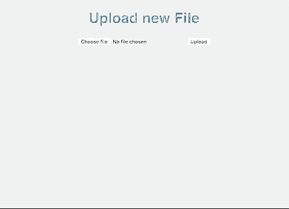

# show-and-tell

A web app to detect objects within an image. It displays and reads back the contents to the user.



## Running the app

See below for instructions on installation and dependencies.
```bash
$ . tensorflow/bin/activate
$ python app.py

```
Navigate a web browser to [http://localhost:5000/](http://localhost:5000/).

## Requirements

Python 2.7, [Tensorflow Object Detection API](https://github.com/tensorflow/models/tree/master/object_detection).

## Installation

```bash
# Clone this repository
$ git clone git@github.com:panteha/show-and-tell.git
$ git submodule init
$ git submodule update

# Go into the repository
$ cd show-and-tell

# Install dependencies
$ pip install virtualenv
$ virtual env tensorflow
$ . tensorflow/bin/activate
$ pip install flask
```
Follow these instructions to install the [Tensorflow Object Detection API installation](https://github.com/tensorflow/models/blob/master/object_detection/g3doc/installation.md).

## Contributors

- Dom McDonnell   [@dmcd84](https://github.com/dmcd84)
- Lubos Michalic  [@lubosmichalic](https://github.com/lubosmichalic)
- Panteha Ahmadi  [@panteha](http://github.com/panteha)
- Alex Satur      [@alexanders89](http://github.com/alexanders89)
